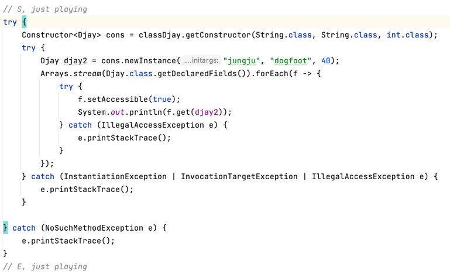

# Clazz
## Class<T> 활용

### Class 가져오는 방법
1. [객체명].class
    > Class<Djay> djayClass = Djay.class
2. [존재하는 객체].getClass();
    > Djay djay = new Djay();  
      Class<?> classDjay2 = djay.getClass();
3. Class.forName()
    > Class<?> classDjay3 = Class.forName("google.djay.djayplayingjava.clazz.Djay");

## Instance 가져오는법
1. Constructor 가져옴
2. .newInstance   
   e.g.
   > Constructor<Djay> constructor = Djay.class.getConstructor(String.class, String.class, int.class);  
     Djay djay1 = constructor.newInstance("jungju", "dogfoot", 50);

### Reflection 활용 가능
- Fields, Methods, Constructors 정보 활용
- 접근제어자 상관없이 접근 가능
   